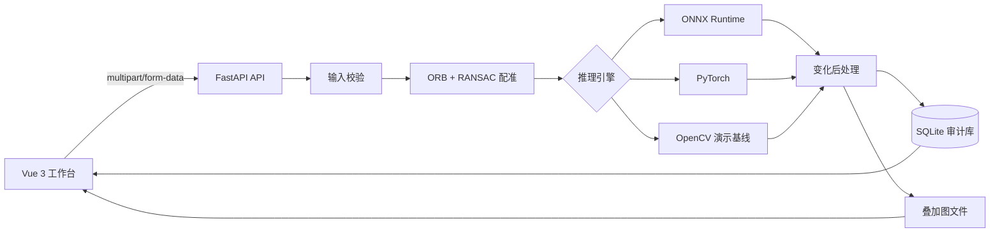

# 系统设计说明书

## 1. 架构总览



系统采用模块化单体架构，满足 20 天实训的实现量和可维护性。算法核心位于独立 Python 包，训练脚本和 API 复用同一后处理实现。

## 2. 模型结构

两个时相共享 ResNet18 编码器，从五个尺度提取特征。每个尺度计算绝对差异，再把前时相、后时相和绝对差异拼接，通过 1 x 1 卷积生成门控权重。门控差异送入逐级上采样解码器，输出一通道变化 logits。

```text
Before -> Shared Encoder -> B0 B1 B2 B3 B4
                                |  |  |  |  |
After  -> Shared Encoder -> A0 A1 A2 A3 A4
                                | Difference Gates
                                v
                         D0 D1 D2 D3 D4
                                |
                         U-Net Decoder
                                |
                         Change Logits
```

共享编码器减少参数并保证两个时相处在一致特征空间；多尺度差异兼顾小建筑边界和大范围变化；门控抑制两期共同背景。

## 3. 损失函数

总损失为：

`L = 0.5 * L_BCE + 0.4 * L_Dice + 0.1 * L_boundary`

- BCE 约束像素分类概率。
- Dice 缓解变化像素占比较低导致的类别不平衡。
- Boundary 对概率图和标签的形态学边界施加 L1 约束。

权重可在 YAML 中修改，任何改动都应进入实验记录。

## 4. 可信推理设计

1. 校准：在验证集上优化单一温度参数，降低概率过度自信。
2. TTA：原图与水平翻转各推理一次，均值作为概率，二者差异作为不确定性。
3. 斑块过滤：开闭运算后过滤小连通域，减少散点噪声。
4. 风险分级：根据变化占比、斑块面积和置信度产生辅助等级，规则公开可审计。

## 5. 数据设计

SQLite `analyses` 表保存任务 ID、时间、图像 URL、引擎、配准状态、变化率、置信度、不确定性、斑块数、风险、结论和斑块 JSON。课程版把文件保存在本地；生产扩展应替换为对象存储和 PostgreSQL。

## 6. 加载优先级

1. `TS_ONNX_PATH` 存在且能加载：ONNX Runtime。
2. `TS_MODEL_PATH` 存在且能加载：PyTorch。
3. 均不可用：OpenCV 启发式演示。

健康接口返回实际引擎，前端顶部持续显示，避免把演示基线误认为已训练模型。

## 7. 可扩展方向

- 加入 GeoTIFF 坐标、GSD 和真实面积。
- 用 SegFormer、ChangeFormer 等主干进行对比实验。
- 从二分类扩展为建筑、水体、植被等语义变化。
- 使用任务队列处理超大影像切片和批量任务。
- 接入 MinIO、PostgreSQL、认证和审计日志。

